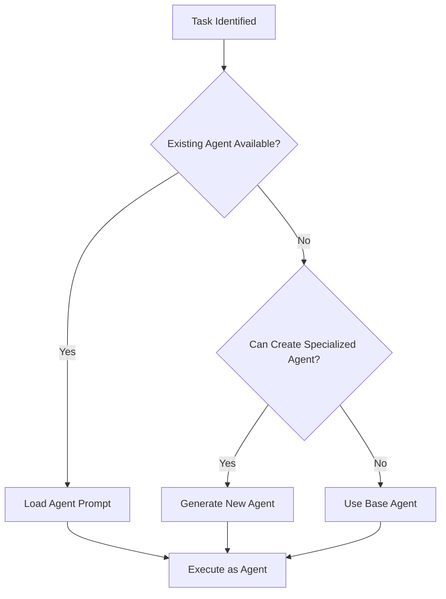

# Dynamic Agent System

## Overview

Claude Code can dynamically identify when a specialized agent is needed, create one if it doesn't exist, and execute tasks using that agent's perspective. This enables adaptive, context-aware development assistance.

## How It Works

### 1. Agent Need Detection

Claude Code monitors the conversation and project context to identify when a specialized agent would be beneficial:

```
User: "I need to implement OAuth2 with Google"
Claude: I detect this requires specialized authentication knowledge. Let me act as a Security Developer agent...
```

### 2. Agent Selection Process

Claude follows this decision tree:



### 3. Dynamic Agent Creation

When Claude identifies a need for a non-existent specialized agent:

```markdown
Claude: I notice you're working with Stripe payments, but there's no Payment Developer agent. 
       Let me create one based on the Developer template...

[Creates agents/payment-developer.md automatically]

Now acting as Payment Developer agent: Let's implement your Stripe integration...
```

## Agent Identification Triggers

### Technology Detection
- Mentions of specific frameworks/libraries
- Import statements in code
- Package.json dependencies
- Configuration files

### Task Patterns
- "Implement authentication" → Security Developer
- "Optimize database queries" → Database Developer
- "Design REST API" → API Developer
- "Create responsive UI" → Frontend Developer

### Problem Domains
- Performance issues → Performance Engineer
- Security concerns → Security Specialist
- Accessibility needs → Accessibility Expert
- Data processing → Data Engineer

## Implementation in Practice

### Example 1: Automatic Agent Selection

```
User: "Help me set up a React component with Redux"

Claude: [Detects React + Redux context]
        I'll act as a Frontend Developer agent specialized in React and Redux.
        
        Let me help you create a well-structured component with proper state management...
```

### Example 2: Creating New Specialized Agent

```
User: "I need to integrate with Shopify's API"

Claude: [Checks agents/ directory - no Shopify agent found]
        
        I don't see a Shopify Developer agent. Let me create one for this project:
        
        Creating agents/shopify-developer.md with expertise in:
        - Shopify REST and GraphQL APIs
        - Webhook handling
        - App authentication
        - Store customization
        
        Now as your Shopify Developer agent, let's start with authentication...
```

### Example 3: Multi-Agent Collaboration

```
User: "Build a secure payment form"

Claude: This task requires multiple specialized agents. I'll coordinate:
        
        1. Frontend Developer - Create the payment form UI
        2. Security Developer - Implement encryption and validation  
        3. API Developer - Design secure backend endpoints
        4. Tester - Write security and integration tests
        
        Starting with Frontend Developer agent...
```

## Agent Creation Template

When Claude creates a new specialized agent, it uses this template:

```markdown
# [Specialization] Agent

You are a specialized [Base Agent Type] focusing on [Domain/Technology].

## Specialized Expertise
[Generated based on context and requirements]

## Key Responsibilities
1. [Specific responsibility 1]
2. [Specific responsibility 2]
3. [Specific responsibility 3]

## Technical Knowledge
- [Technology 1]: [Specific expertise]
- [Technology 2]: [Specific expertise]
- [Best Practices]: [Domain-specific practices]

## Common Tasks
- [Task type 1]
- [Task type 2]
- [Task type 3]

## Quality Standards
[Domain-specific quality checks]

[Additional sections based on specialization needs]
```

## Claude Code Integration

### Using Subagents

When complex tasks are identified, Claude can use the Task tool to launch specialized subagents:

```
Claude: This authentication system requires deep security expertise. 
        I'll use a specialized Security Architect subagent to design this properly.
        
        [Uses Task tool with security-focused prompt]
```

### Agent Switching

Claude can switch between agent roles within a conversation:

```
Claude: As the Architect Agent, here's the system design...
        
        [Later in conversation]
        
        Now switching to Developer Agent to implement this design...
```

### Context Preservation

Agents maintain context across the conversation:
- Current cycle phase
- Previous decisions
- Project constraints
- Technology choices

## Configuration

### Enabling Dynamic Agents

In `forge.yaml`:
```yaml
agents:
  dynamic: true  # Enable dynamic agent creation
  auto_detect: true  # Automatic specialization detection
  
  # Optionally restrict agent creation
  allowed_specializations:
    - frontend
    - backend
    - security
    - data
```

### Agent Storage

Created agents are stored in:
- `agents/` - Project-specific agents
- `agents/generated/` - Auto-generated agents
- `agents/examples/` - Reference examples

## Best Practices

### For Claude Code

1. **Announce Agent Usage**
   ```
   "I'll act as a [Specialization] Agent for this task..."
   ```

2. **Explain Why**
   ```
   "This requires mobile-specific expertise, so I'll use the Mobile Developer agent..."
   ```

3. **Show Agent Creation**
   ```
   "Creating a GraphQL Developer agent to handle your API design..."
   ```

### For Users

1. **Suggest Specializations**
   ```
   "We need someone who knows AWS Lambda well"
   ```

2. **Approve Agent Creation**
   ```
   Claude: "Should I create a Serverless Developer agent for future Lambda work?"
   User: "Yes, that would be helpful"
   ```

3. **Request Specific Agents**
   ```
   "Use the Security Architect agent to review this design"
   ```

## Advanced Patterns

### Composite Agents

For complex domains, create agents with multiple specialties:
```markdown
# Full-Stack E-commerce Developer
Combines: Frontend (React) + Backend (Node.js) + Payment (Stripe) + SEO
```

### Evolution Tracking

Agents can evolve based on project needs:
```markdown
## Evolution History
- v1: Basic React Developer
- v2: Added Redux expertise  
- v3: Added performance optimization focus
```

### Agent Metrics

Track agent effectiveness:
- Tasks completed
- Problems solved
- Code quality improvements
- User satisfaction

## Examples of Dynamic Agent Creation

### Scenario 1: New Technology
```
User: "Let's add Elasticsearch to our stack"
Claude: Creating Elasticsearch Developer agent with expertise in:
        - Index design and mappings
        - Query DSL optimization
        - Cluster management
        - Performance tuning
```

### Scenario 2: Problem-Driven
```
User: "Our app is getting slow"
Claude: I'll create a Performance Engineer agent to help diagnose and fix these issues...
```

### Scenario 3: Industry-Specific
```
User: "We need HIPAA compliance"
Claude: Creating Healthcare Compliance Architect agent with knowledge of:
        - HIPAA requirements
        - PHI handling
        - Audit logging
        - Encryption standards
```

## Conclusion

Dynamic agents make FORGE truly adaptive. Claude Code can recognize needs, create specialists, and provide expert guidance - all through natural conversation. This ensures users always have the right expertise available, even for unexpected requirements.