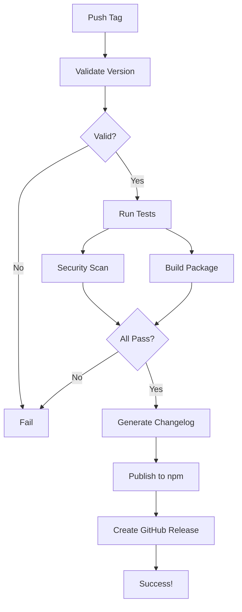

# Release Process Guide

This guide explains how to create a new release of FORGE Framework.

## Automated Release Pipeline

FORGE uses GitHub Actions to automatically build and publish releases when you create a version tag.

### Prerequisites

1. **NPM Token**: Set up `NPM_TOKEN` secret in GitHub repository settings
   - Go to npm.com → Access Tokens → Generate New Token
   - Choose "Automation" type
   - Add as repository secret: Settings → Secrets → Actions → New repository secret

2. **Conventional Commits**: Use conventional commit format for automatic changelog
   - `feat:` for new features
   - `fix:` for bug fixes
   - `docs:` for documentation
   - `chore:` for maintenance
   - Add `BREAKING CHANGE:` in body for breaking changes

## Creating a Release

### 1. Stable Release

```bash
# Update version in package.json
npm version 1.0.0

# Create and push tag
git tag v1.0.0
git push origin v1.0.0
```

### 2. Beta Release

```bash
# Update version in package.json
npm version 1.0.0-beta.1

# Create and push tag
git tag v1.0.0-beta.1
git push origin v1.0.0-beta.1
```

## What Happens Next

1. **Validation**: Checks tag format and determines release type
2. **Testing**: Runs tests on multiple OS and Node.js versions
3. **Security**: Scans for vulnerabilities and secrets
4. **Build**: Creates npm package
5. **Changelog**: Generates release notes from commits
6. **Publish**: Publishes to npm registry
7. **Release**: Creates GitHub release with artifacts

## Release Workflow



## Manual Rollback

If a bad release is published:

1. **npm Deprecation**:
   ```bash
   npm deprecate forge-framework@1.0.0 "This version has issues, use 1.0.1"
   ```

2. **Unpublish (within 72 hours)**:
   ```bash
   npm unpublish forge-framework@1.0.0
   ```

3. **GitHub Release**:
   - Mark as pre-release
   - Add warning to release notes
   - Delete if necessary

## Troubleshooting

### Release Failed

1. Check GitHub Actions logs
2. Common issues:
   - Invalid NPM_TOKEN
   - Test failures
   - Network issues
   - Tag already exists

### npm Publish Failed

- Verify NPM_TOKEN is valid
- Check if version already exists
- Ensure you have publish permissions

### Security Scan Failed

- Run `npm audit fix` locally
- Update vulnerable dependencies
- Document known issues if can't fix

## Best Practices

1. **Test Locally First**
   ```bash
   npm test
   npm pack --dry-run
   ```

2. **Version Bumping**
   - Major: Breaking changes
   - Minor: New features
   - Patch: Bug fixes

3. **Release Notes**
   - Use conventional commits
   - Document breaking changes
   - Credit contributors

4. **Beta Testing**
   - Use beta releases for testing
   - Get feedback before stable release
   - Document beta limitations